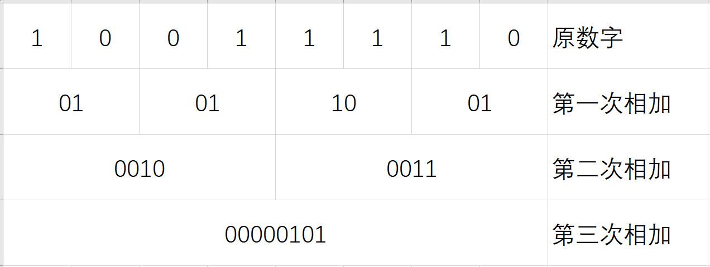

## 实验说明

实验网址：  
http://csapp.cs.cmu.edu/3e/labs.html  
（"Self-Study Handout"无需账号即可下载实验内容）

### Data Lab [Updated 12/16/19]

> Students implement simple logical, two's complement, and floating point functions, but using a highly restricted subset of C. For example, they might be asked to compute the absolute value of a number using only bit-level operations and straightline code. This lab helps students understand the bit-level representations of C data types and the bit-level behavior of the operations on data.

> 使用C语言的子集编写位运算函数。

这里的子集是指：禁用控制语句（`if`、`while`等）、只有部分运算符可用……  

## 实验记录

仅简单记录题目以及解法。  

实验环境：`x86_64 Ubuntu 22.04 (WSL 2)`

### **bitXor**

Description | x^y using only ~ and &
           -|-
Legal ops   | ~ &
Max ops     | 8

根据“异或”的性质（不同为真，否则为假），我们可以用“非”、“与”、“或”得到“异或”的表达式：
$$ a \oplus b = (\neg a \wedge b) \vee (a \wedge \neg b) $$
但是题目只允许使用“非”、“与”，所以我们使用“非”、“与”来表达“或”：
$$ a \vee b = \neg(\neg a \wedge \neg b) $$
于是最后的表达式为：
$$ a \oplus b = \neg(\neg (\neg a \wedge b) \wedge \neg (a \wedge \neg b)) $$

```C
int bitXor(int x, int y) {
  // a ^ b = ((~a)&(b))|((a)&(~b))
  // a | b = ~((~a)&(~b))
  return ~((~((~x) & (y))) & (~((x) & (~y))));
}
```

参考：  
[维基百科：逻辑代数](https://zh.wikipedia.org/zh-cn/%E9%80%BB%E8%BE%91%E4%BB%A3%E6%95%B0)  
[维基百科：逻辑异或](https://zh.wikipedia.org/zh-cn/%E9%80%BB%E8%BE%91%E5%BC%82%E6%88%96)

### tmin

Description | return minimum two's complement integer
           -|-
Legal ops   | ! ~ & ^ \| + \<< \>>
Max ops     | 4

根据补码的性质，我们知道32位最小补码应该是`0x80000000`（-2147483648）。

```C
int tmin(void) {
  return 1<<31;
}
```

### **isTmax**

Description | returns 1 if x is the maximum, two's complement number, and 0 otherwise
           -|-
Legal ops   | ! ~ & ^ \| +
Max ops     | 10
  
这题我写了两个版本，第一版使用了位移符号，然而题目并不允许使用位移符号。  
**第一版思路**：  
（前置知识：异或两个相同的数，结果为0）  
若`x`是`0x7FFFFFFF`，那么取反的结果应该仅有最高位为1，即`0x80000000`。我们使用异或来代替`==`符号，将`x`与`0x80000000`异或，其结果应该是0，对其进行逻辑取反即为返回值。  
若`x`并非`0x7FFFFFFF`，那么其取反、异或后的结果非0，逻辑取反得到0。  
**第二版思路**：  
有了第一版的基础，现在问题就变成如何不用位移符号表示`0x80000000`。  
很容易想到，如果`x`是`0x7FFFFFFF`，那么`x+1`的结果就是`0x80000000`。  
我尝试编译测试了以下代码，然而并没有通过测试，败在了测试点`isTmax(-1)`。
```C
int isTmax(int x) {
  return (!((x + 1) ^ (~x)));
}
```
那么……我们增加对-1的特判？这样可以解决所有问题码？  
我们先考虑，除了-1，别的数字能否如预期般运行？  
若一个数字的最低位是0，那么+1后高位不变，高位在取反、异或后必然非0。  
若一个数字的最低位是1，那么+1后所有与之前最低位1相连的1都会变为0，直到将最低的0变为1，即对0及之前的位（较低的位）进行取反，这部分在取反、异或后还是0；那么高位呢？和最低位是0一样，高位依然不变，则高位在取反、异或后必然非0。  
-1的特殊之处就在于它的补码表示中没有0，即没有更高的位可以保持不变了，从而导致最终结果为0（取反前）。  

对-1进行特判并不难，正如下方Version 2的代码所示（利用对-1进行+1后会得到0的性质）。  

如何更好地理解这份代码（Version 2）呢？  
基于上方的讨论，+1可以看作是对**最低0及更低位**进行取反操作  
那么我们可以很容易地想到有两个数+1与取反的结果是相同的：`0xFFFFFFFF`（没有0）和`0x7FFFFFFF`（最高位是0）。  

```C
// Version 1
int isTmax(int x) {
  return !((1 << 31) ^ (~x));
}
// Version 2
int isTmax(int x) {
  int n1 = !(x + 1);
  return (!n1) & (!((x + 1) ^ (~x)));
}
```

参考：  
[知乎：CSAPP datalab 第3题 isTmax](https://zhuanlan.zhihu.com/p/558596568)  
[Stack Overflow: How to find TMax without using shifts](https://stackoverflow.com/questions/7300650/how-to-find-tmax-without-using-shifts)

### allOddBits

Description | return 1 if all odd-numbered bits in word set to 1 where bits are numbered from 0 (least significant) to 31 (most significant)
           -|-
Legal ops   | ! ~ & ^ \| + \<< \>>
Max ops     | 12

```C
int allOddBits(int x) {
  int aa = (0xAA << 24) | (0xAA << 16) | (0xAA << 8) | (0xAA);
  return !((x & aa) ^ aa);
}
```

### negate

Description | return -x
           -|-
Legal ops   | ! ~ & ^ \| + \<< \>>
Max ops     | 5

```C
int negate(int x) {
  return (~x) + 1;
}
```

### isAsciiDigit

Description | return 1 if 0x30 <= x <= 0x39 (ASCII codes for characters '0' to '9')
           -|-
Legal ops   | ! ~ & ^ \| + \<< \>>
Max ops     | 15

对于高4位，判断是否与0x3相同。  
对于低4位，判断是否小于或等于0x9。  

```C
int isAsciiDigit(int x) {
  int hi4 = (x >> 4) ^ 0x3;
  int lo4 = ((x & 0xF) + 6) >> 4;
  return (!hi4) & (!lo4);
}
```

### conditional

Description | same as x ? y : z
           -|-
Legal ops   | ! ~ & ^ \| + \<< \>>
Max ops     | 16

连续使用`!`可以规整变量为单纯的0或1。  

```C
int conditional(int x, int y, int z) {
  int mask = !!x;
  mask = mask | (mask << 1);
  mask = mask | (mask << 2);
  mask = mask | (mask << 4);
  mask = mask | (mask << 8);
  mask = mask | (mask << 16);
  return (y & mask) | (z & ~mask);
}
```

参考：  
[CSDN：位运算练习之用互斥条件实现if判断](https://blog.csdn.net/weixin_43923436/article/details/117553017)

### isLessOrEqual

Description | if x <= y  then return 1, else return 0
           -|-
Legal ops   | ! ~ & ^ \| + \<< \>>
Max ops     | 24

如果可以第一时间想到之前的取相反数（[negate](#negate)）的话，还是蛮简单的。  

```C
int isLessOrEqual(int x, int y) {
  int nx = (~x) + 1;
  int res = (y + nx) >> 31; // 1 if x>y ---> 0>y-x (signed)
  return !res;
}
```

### logicalNeg

Description | implement the ! operator, using all of the legal operators except !
           -|-
Legal ops   | ~ & ^ \| + \<< \>>
Max ops     | 12

将所有“信息”汇总到最低位。  

```C
int logicalNeg(int x) {
  x = x | (x >> 16);
  x = x | (x >> 8);
  x = x | (x >> 4);
  x = x | (x >> 2);
  x = x | (x >> 1);
  return 1 & ~x;
}
```

### **howManyBits**

Description | return the minimum number of bits required to represent x in two's complement
           -|-
Legal ops   | ! ~ & ^ \| + \<< \>>
Max ops     | 90

1. 将输入统一为正数
2. 将最高1往下的位全部置1
3. 计算1的个数，最后+1即可

这题还有一个思路就是一位一位地计算1的个数，但会超出符号数量限制（  

值得一提的是如何计算1的个数。  
其实二进制本身已经告诉我们有多少个1了，只不过它是一位一位地告诉我们的。  
以8位二进制数`0b10011110`为例，第7位（最高位）有一个1，第6位没有1，第五位也没有1，第四位有一个1……
我们需要做的，就是把这些分开的数量相加起来而已。具体怎么做呢？请看下方代码。  
```C
int x = 158; // 0b10011110
x = (x & 0x55) + ((x >> 1) & 0x55); // 第一次相加
x = (x & 0x33) + ((x >> 2) & 0x33); // 第二次相加
x = (x & 0x0F) + ((x >> 4) & 0x0F); // 第三次相加
// 现在 x 的值就是 158 二进制表示中 1 的个数
```
……一时间没看明白对吧，请看下图——过程中`x`二进制的变化（低8位）。

可以看到，这是一种分治的办法，从原始的每一位里1的个数、到每两位里1的个数、再到每四位里1的个数，最后变为八位里1的个数。  

可惜实验对常量有使用限制，不能用太大的常量，否则就可以像[Matrix67](http://www.matrix67.com/blog/archives/264)博客里那样一次性处理32位数字了。  

```C
int howManyBits(int x) {
  int a, b, c, d;
  // 将所有**有效位**置1
  x = ((~x) & (x >> 31)) | (x & ~(x >> 31));
  x = x | (x >> 1);
  x = x | (x >> 2);
  x = x | (x >> 4);
  x = x | (x >> 8);
  x = x | (x >> 16);
  // 0...8
  a = (x & 0x55) + ((x >> 1) & 0x55);
  a = (a & 0x33) + ((a >> 2) & 0x33);
  a = (a & 0x0F) + ((a >> 4) & 0x0F);
  // 8...16
  x = x >> 8;
  b = (x & 0x55) + ((x >> 1) & 0x55);
  b = (b & 0x33) + ((b >> 2) & 0x33);
  b = (b & 0x0F) + ((b >> 4) & 0x0F);
  // 16...24
  x = x >> 8;
  c = (x & 0x55) + ((x >> 1) & 0x55);
  c = (c & 0x33) + ((c >> 2) & 0x33);
  c = (c & 0x0F) + ((c >> 4) & 0x0F);
  // 24...32
  x = x >> 8;
  d = (x & 0x55) + ((x >> 1) & 0x55);
  d = (d & 0x33) + ((d >> 2) & 0x33);
  d = (d & 0x0F) + ((d >> 4) & 0x0F);
  return a + b + c + d + 1;
}
```

参考：  
[Matrix67：位运算简介及实用技巧（二）：进阶篇(1)](http://www.matrix67.com/blog/archives/264)

### floatScale2

Description | Return bit-level equivalent of expression 2*f for floating point argument f. Both the argument and result are passed as unsigned int's, but they are to be interpreted as the bit-level representation of single-precision floating point values. When argument is NaN, return argument
           -|-
Legal ops   | Any integer/unsigned operations incl. \|\|, &&. also if, while
Max ops     | 30

没有技巧，全是 ~~感情~~ [TDD](https://zh.wikipedia.org/zh-cn/%E6%B5%8B%E8%AF%95%E9%A9%B1%E5%8A%A8%E5%BC%80%E5%8F%91)

```C
unsigned floatScale2(unsigned uf) {
  unsigned sig, exp, fra;
  
  if (uf == 0xFFFFFFFF)
    return uf;

  sig = uf & 0x80000000;
  exp = uf & 0x7F800000;
  fra = uf & 0x007FFFFF;

  if (exp && exp != 0x7F800000) {
    exp = exp + 0x00800000;
  } else if (fra) {
    fra = fra << 1;
    if (fra & 0xFF800000) {
      if (exp != 0x7F800000) {
        exp = exp + 0x00800000;
        fra = fra & 0x007FFFFF;
      } else {
        fra = fra >> 1;
      }
    }
  }

  return sig | exp | fra;
}
```

参考：  
[维基百科：IEEE 754](https://zh.wikipedia.org/wiki/IEEE_754)  
[Wikipedia: Single-precision floating-point format](https://en.wikipedia.org/wiki/Single-precision_floating-point_format)

### floatFloat2Int

Description | Return bit-level equivalent of expression (int) f for floating point argument f. Argument is passed as unsigned int, but it is to be interpreted as the bit-level representation of a single-precision floating point value. Anything out of range (including NaN and infinity) should return 0x80000000u.
           -|-
Legal ops   | Any integer/unsigned operations incl. \|\|, &&. also if, while
Max ops     | 30

```C
int floatFloat2Int(unsigned uf) {
  int sig, exp, fra, res;
  sig = (uf & 0x80000000);
  exp = (uf & 0x7F800000) >> 23;
  fra = (uf & 0x007FFFFF) | 0x00800000;

  if (exp == 0)
    return 0;
  if (exp == 0xFF)
    return 0x80000000u;

  exp = (exp - 127);
  if (0 <= exp && exp <= 23) {
    res = fra >> (23 - exp);
    if (sig)
      return (~res) + 1;
    else
      return res;
  } else if (exp < 0) {
    return 0;
  } else
    return 0x80000000u;
}
```

### floatPower2

Description | Return bit-level equivalent of the expression 2.0^x (2.0 raised to the power x) for any 32-bit integer x. The unsigned value that is returned should have the identical bit representation as the single-precision floating-point number 2.0^x. If the result is too small to be represented as a denorm, return 0. If too large, return +INF.
           -|-
Legal ops   | Any integer/unsigned operations incl. \|\|, &&. also if, while
Max ops     | 30

```C
unsigned floatPower2(int x) {
  int exp = x + 127;
  if (exp <= 0)
    return 0;
  else if (255 <= exp)
    return 0x7F800000;
  else
    return exp << 23;
}
```

## 实验结果及感想

代码功能检查
```bash
$ ./btest
Score   Rating  Errors  Function
 1      1       0       bitXor
 1      1       0       tmin
 1      1       0       isTmax
 2      2       0       allOddBits
 2      2       0       negate
 3      3       0       isAsciiDigit
 3      3       0       conditional
 3      3       0       isLessOrEqual
 4      4       0       logicalNeg
 4      4       0       howManyBits
 4      4       0       floatScale2
 4      4       0       floatFloat2Int
 4      4       0       floatPower2
Total points: 36/36
```

代码规范检查
```bash
$ ./dlc -Wall -e bits.c
dlc:bits.c:148:bitXor: 8 operators
dlc:bits.c:155:tmin: 1 operators
dlc:bits.c:167:isTmax: 8 operators
dlc:bits.c:179:allOddBits: 9 operators
dlc:bits.c:187:negate: 2 operators
dlc:bits.c:201:isAsciiDigit: 8 operators
dlc:bits.c:217:conditional: 16 operators
dlc:bits.c:229:isLessOrEqual: 5 operators
dlc:bits.c:246:logicalNeg: 12 operators
dlc:bits.c:288:howManyBits: 72 operators
dlc:bits.c:326:floatScale2: 15 operators
dlc:bits.c:361:floatFloat2Int: 16 operators
dlc:bits.c:383:floatPower2: 4 operators
```

从第一次打开实验到现在，已经过了一周……但终究是把坑填上了 ~~（这只是CSAPP的第一个实验~~  
从时间上来说，我完全投入到这个实验（包括此文章）的时间大概有……12个小时，差不多一题一个小时吧。  
说实话，我觉得这些实验还是有点难的……但有趣的地方也是有的。  

实验完整代码：  
https://gist.github.com/CYTMWIA/d80e43b1e1dec81f7b801448ba770075
